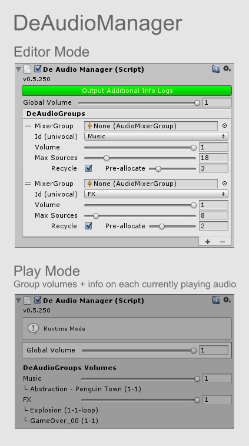
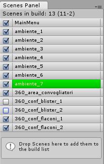
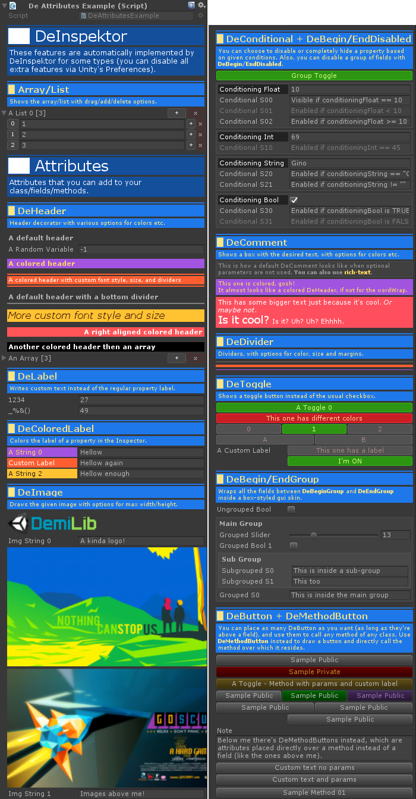
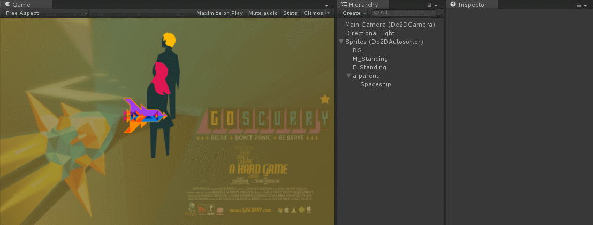
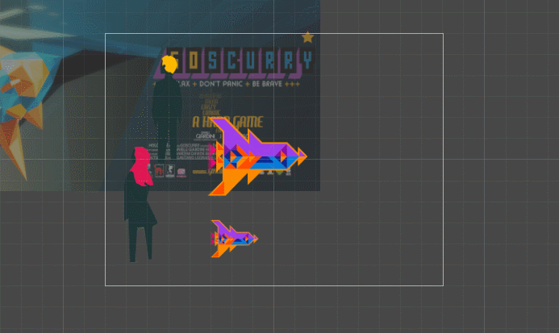
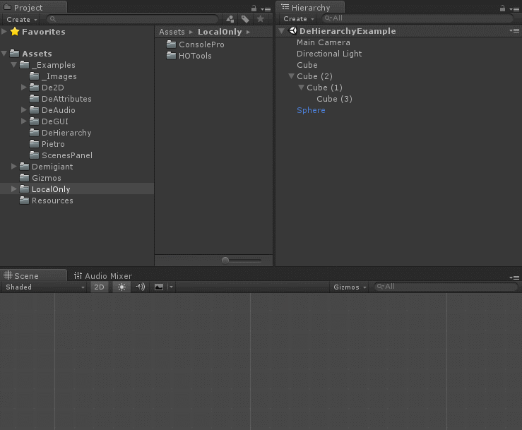
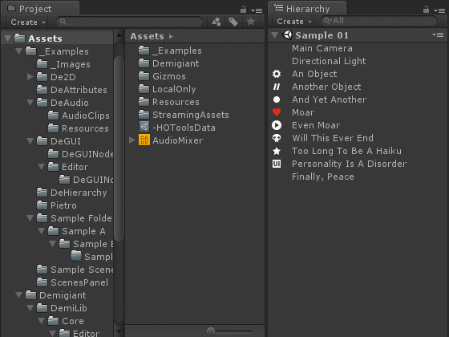

# DemiLib
Various utility libraries for Unity (alpha).  
Developed by Daniele Giardini - http://www.demigiant.com

#### [Read more on the Wiki](https://github.com/Demigiant/demilib/wiki) - or check the [API](http://demigiant.github.io/apis/demilib/html/namespace_d_g.html)

**You can get it all, or only single configurations, from the [downloads section](https://github.com/Demigiant/demilib/wiki/Downloads)**

